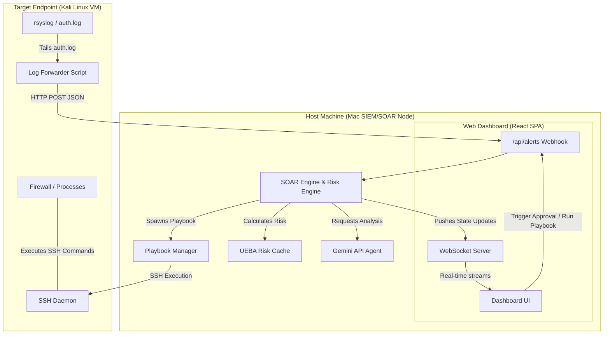

# REVEAL: Autonomous AI-Driven SIEM & SOAR Platform

REVEAL is a next-generation Security Operations Center (SOC) threat command center. It bridges the gap between threat visibility (**SIEM**) and active incident mitigation (**SOAR**). Inspired by enterprise platforms like *Gurucul REVEAL*, this platform ingests endpoint logs, dynamically scores entity risk, queries Gemini AI for real-time threat triage, and executes automated containment playbooks on target endpoints (such as a Kali Linux VM) over secure SSH channels.

---

## 🛠️ Key Capabilities

*   **Real-Time SIEM Stream**: WebSocket-driven alerts feed detailing security events in under 1 second.
*   **Gurucul-Style UEBA Risk Engine**: Computes rolling threat risk scores (0–100) for Hosts, Users, and IPs based on event severity, with built-in risk decay over time.
*   **AI-Powered Incident Triage**: Automatically queries the Gemini API to write executive summaries, impact assessments, and recommended remediation playbooks for active alerts.
*   **SOAR Orchestration Playbooks**: Interactive, step-by-step playbooks (such as `block-ip`, `kill-process`, and `quarantine-file`) showing visual progression nodes.
*   **Active SSH Containment**: Mac host logs directly into Kali Linux to execute real-time terminal mitigations (e.g. firewall bans via `iptables`, process kills via `SIGKILL`).

---

## 📐 Architecture Blueprint



---

## 💻 Tech Stack

*   **Frontend**: React (Vite), Lucide Icons, WebSocket Client, Custom CSS Grid/Glassmorphism.
*   **Backend**: Node.js (Express), WebSocket Server (`ws`), SSH Client (`ssh2`), dotenv, Google GenAI SDK.
*   **Agent**: Python 3 (Regular expressions log tailing parser, requests).

---

## 🚀 Quick Start Guide

### 1. Launch the Backend Server (Mac Host)
```bash
cd backend
npm install
npm start
```
*The server will boot on port `5001` and run a threat simulator in the background by default.*

### 2. Launch the Web Dashboard (Mac Host)
```bash
cd frontend
npm install
npm run dev
```
*Open `http://localhost:5173` in your browser.*

### 3. Start the Log Forwarder (Kali VM)
Run the tailing script inside your Kali VM pointing to your Mac host's IP (e.g., `192.168.64.1` if running NAT under Apple Virtualization):
```bash
sudo python3 forwarder.py --url http://192.168.64.1:5001/api/alerts --file /var/log/auth.log
```

---

## 🛡️ Operational Playbooks (Remediation Details)

The platform supports three core SOAR containment actions:

1.  **Block IP (`block-ip`)**: Automatically appends drop rules to the Kali firewall:
    ```bash
    sudo iptables -A INPUT -s <IP> -j DROP
    ```
2.  **Kill Process (`kill-process`)**: Forcibly terminates suspect running PIDs:
    ```bash
    sudo kill -9 <PID>
    ```
3.  **Quarantine File (`quarantine-file`)**: Isolates malicious scripts and strips permissions:
    ```bash
    sudo mkdir -p /tmp/quarantine && sudo mv <FILE> /tmp/quarantine/ && sudo chmod 000 /tmp/quarantine/<FILE>
    ```

---

## 📝 Setup and Credentials Config
Configure the backend variables inside `backend/.env` to enable SSH VM integrations:
```env
PORT=5001
GEMINI_API_KEY=your_gemini_key

# Kali VM Target Credentials
KALI_SSH_HOST=192.168.64.3
KALI_SSH_PORT=22
KALI_SSH_USER=kali
KALI_SSH_PASSWORD=kali
```
